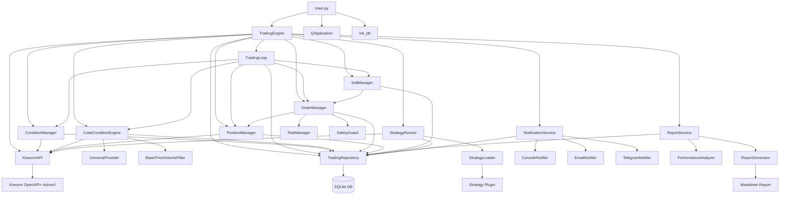
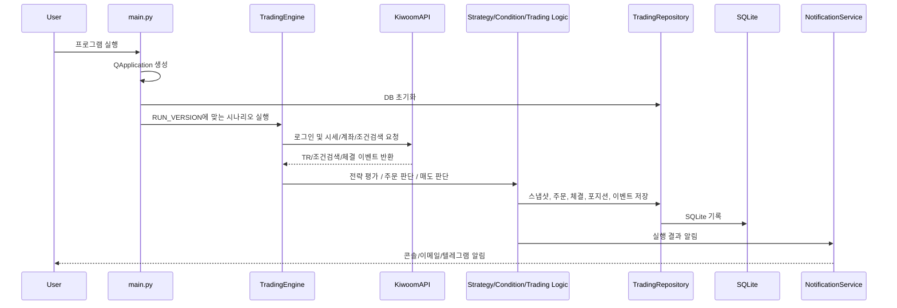
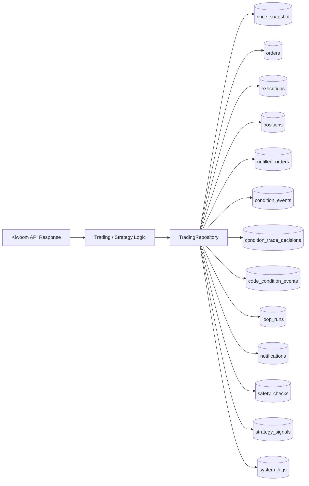

# Kiwoom SQLite Auto Trader

Windows 환경에서 `PyQt5 + Kiwoom OpenAPI+ + SQLite`를 사용해 자동매매 실험, 계좌/주문 추적, 조건검색, 알림, 리포트 생성을 수행하는 프로젝트입니다.

## Overview

- 실행 진입점은 `main.py`입니다.
- 실행 모드는 `config/settings.yaml`의 `app.run_version`으로 선택합니다.
- 핵심 흐름은 `키움 API 연동 -> 전략/조건 평가 -> 주문/매도 판단 -> DB 기록 -> 알림/리포트`입니다.
- 데이터 저장소는 SQLite(`data/trading.db`)입니다.

## Architecture Diagram



## Runtime Flow



## Module Map

### 1. Entry Point

- `main.py`
  - `QApplication` 생성
  - DB 초기화
  - `RUN_VERSION`에 따라 `TradingEngine`의 시나리오 실행

### 2. Configuration

- `config.py`
  - YAML 및 `.env` 로드
  - 주문/조건검색/루프/알림/리포트/안전장치 설정을 전역 상수로 제공
- `config/settings.yaml`
  - 기본 실행 설정 파일

### 3. Broker Layer

- `app/kiwoom/kiwoom_api.py`
  - 키움 OpenAPI+ ActiveX 래퍼
  - 로그인, 현재가 조회, 계좌 조회, 미체결 조회
  - 조건검색 로드/실행/중지
  - 시장가 매수/매도 주문
  - 체결(Chejan) 이벤트 수신

### 4. Trading Orchestration

- `app/trading/trading_engine.py`
  - 실행 버전을 시나리오 파일로 라우팅하는 상위 오케스트레이터
- `app/trading/trading_loop.py`
  - 계좌 동기화, 매도 판단, 조건기반 매수 판단을 반복 실행

### 4.1 Scenario Layer

- `app/scenarios/`
  - `RUN_VERSION`별 실행 파일 모음
  - 각 버전 기능을 파일 단위로 분리
  - 상세 브랜치 운영 기준은 `BRANCH_STRATEGY.md` 참고

### 5. Strategy / Condition Layer

- `app/kiwoom/condition_manager.py`
  - 키움 HTS 조건검색식 기반 후보 추출 및 주문 평가
- `app/strategy/code_condition_engine.py`
  - 코드/YAML 기반 조건검색 엔진
  - Universe 순회 후 가격/거래량 조건으로 종목 선별
- `app/strategy/filters.py`
  - 기본 가격/거래량 필터
- `app/strategy/universe_provider.py`
  - 조건검색 대상 종목군 공급
- `app/strategy/strategy_runner.py`
  - 전략 플러그인 실행기
- `app/strategy/strategy_loader.py`
  - 전략 플러그인 로더
- `app/strategy/plugins/price_volume_plugin.py`
  - 예시 전략 플러그인

### 6. Order / Risk / Safety Layer

- `app/trading/order_manager.py`
  - 매수/매도 주문 실행과 주문 결과 기록
- `app/trading/position_manager.py`
  - 계좌/보유종목/미체결 동기화
- `app/trading/sell_manager.py`
  - 익절/손절 규칙 기반 매도 판단
- `app/trading/risk_manager.py`
  - 실행 환경 및 종목당 매수 금액 제한 검사
- `app/trading/safety_guard.py`
  - 실전 방지, 블랙리스트, 일일 주문 한도, 장 시작/종료 버퍼 등 최종 안전장치
- `app/trading/market_time.py`
  - 장 운영 시간 체크

### 7. Persistence Layer

- `app/database/db.py`
  - SQLite 연결 및 스키마 초기화
- `app/database/repository.py`
  - 스냅샷, 주문, 체결, 포지션, 조건검색 이벤트, 루프 실행 기록, 안전체크 저장
- `app/database/schema.sql`
  - 전체 테이블 정의

### 8. Notification / Report Layer

- `app/notifier/notification_service.py`
  - 콘솔/이메일/텔레그램 알림 라우팅
- `app/report/performance_analyzer.py`
  - 최근 거래/조건검색/알림/루프 기록 분석
- `app/report/report_generator.py`
  - Markdown 리포트 생성
- `app/report/report_service.py`
  - 리포트 생성 및 전송

## Data Flow



## RUN_VERSION Map

`main.py`는 `RUN_VERSION` 값에 따라 아래 기능을 실행합니다.

| RUN_VERSION | 목적 |
| --- | --- |
| `v1` | 이동평균 시뮬레이션 |
| `v2` | 키움 현재가 스냅샷 조회 |
| `v3` | 모의 시장가 매수 테스트 |
| `v4` | 주문 및 포지션 추적 테스트 |
| `v5` | 키움 조건검색 테스트 |
| `v5.1` | 코드 기반 조건검색 테스트 |
| `v6` | 조건검색 기반 주문 평가/실행 |
| `v6.1` | 코드 조건검색 기반 주문 평가/실행 |
| `v7` | 익절/손절 매도 로직 테스트 |
| `v8`, `v8.2` | 자동 운용 루프 |
| `v10` | 거래 리포트 생성 |
| `v11` | 안전장치 테스트 |
| `v12` | 전략 플러그인 테스트 |
| `password` | 계좌 비밀번호 입력 창 호출 |

## Key Characteristics

- 장점
  - 실전형 흐름에 가까운 구조
  - 주문 전 다층 안전장치 적용
  - SQLite 기반 추적/리포팅이 쉬움
  - 조건검색, 전략 플러그인, 알림 채널로 확장 가능

- 제약
  - Windows 및 Kiwoom OpenAPI+ 환경 의존
  - ActiveX 기반이라 이식성이 낮음
  - `RUN_VERSION` 중심 구조라 기능이 늘수록 엔진이 커질 수 있음
  - 테스트 코드와 백테스트 체계는 아직 없음

## Directory Structure

```text
.
|-- main.py
|-- BRANCH_STRATEGY.md
|-- config.py
|-- requirements.txt
|-- config/
|   `-- settings.yaml
|-- app/
|   |-- database/
|   |-- kiwoom/
|   |-- notifier/
|   |-- report/
|   |-- scenarios/
|   |-- strategy/
|   `-- trading/
|-- data/
|-- logs/
`-- reports/
```

## Requirements

- Windows
- Kiwoom OpenAPI+ 설치
- PyQt5
- 32-bit Python 환경 검토 필요

## Install

```bash
pip install -r requirements.txt
```

## Run

1. `config/settings.yaml`에서 `app.run_version`을 선택합니다.
2. 필요 시 주문/안전/알림 설정을 조정합니다.
3. 아래 명령으로 실행합니다.

```bash
python main.py
```

## Recommended Reading Order

프로젝트를 빠르게 이해하려면 아래 순서가 좋습니다.

1. `main.py`
2. `config.py`
3. `app/trading/trading_engine.py`
4. `app/trading/trading_loop.py`
5. `app/kiwoom/kiwoom_api.py`
6. `app/trading/order_manager.py`
7. `app/database/repository.py`
