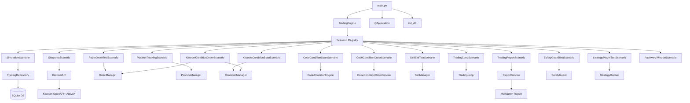
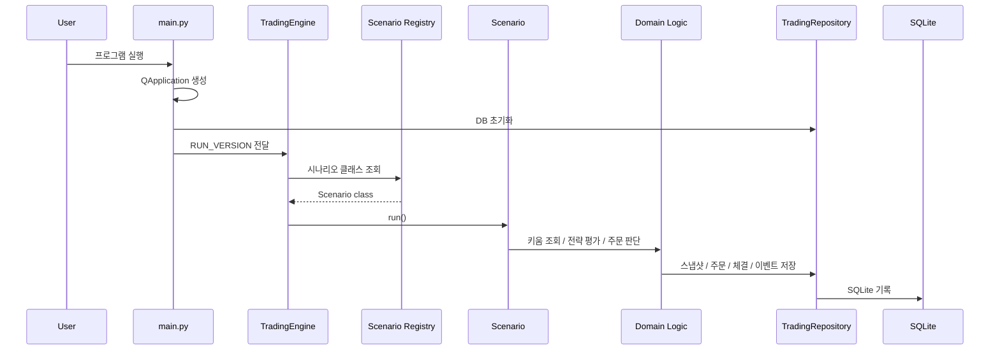

# Kiwoom SQLite Auto Trader

Windows 환경에서 `PyQt5 + Kiwoom OpenAPI+ + SQLite`를 사용해 자동매매 실험, 계좌/주문 추적, 조건검색, 알림, 리포트 생성을 수행하는 프로젝트입니다.

## Overview

- 실행 진입점은 `main.py`입니다.
- 실행 모드는 `config/settings.yaml`의 `app.run_version`으로 선택합니다.
- 핵심 흐름은 `키움 API 연동 -> 전략/조건 평가 -> 주문/매도 판단 -> DB 기록 -> 알림/리포트`입니다.
- 데이터 저장소는 SQLite(`data/trading.db`)입니다.

## Current Branch Workflow

현재 저장소는 아래 흐름으로 관리합니다.

```text
clean-base -> feature/* -> integration/all-features -> main
```

- `clean-base`
  - 공통 인프라 전용 브랜치
  - 새 기능 브랜치의 출발점
- `feature/*`
  - 기능별 전용 브랜치
  - 각 브랜치는 `clean-base + 해당 기능 파일`만 포함
- `integration/all-features`
  - feature 브랜치를 순차적으로 merge하며 충돌을 해소하는 통합 브랜치
- `main`
  - 최종 검증 완료본

## Architecture Diagram



## Runtime Flow



## Module Map

### Entry Point

- `main.py`
  - `QApplication` 생성
  - DB 초기화
  - `RUN_VERSION`을 `TradingEngine`으로 전달

### Configuration

- `config.py`
  - YAML 및 `.env` 로드
  - 주문, 조건검색, 루프, 리포트, 안전장치 설정 제공
- `config/settings.yaml`
  - 기본 실행 설정 파일

### Scenario Layer

- `app/scenarios/`
  - `RUN_VERSION`별 실행 파일 모음
  - 각 기능을 시나리오 파일 단위로 분리
- `app/scenarios/registry.py`
  - `RUN_VERSION -> Scenario` 매핑

### Broker Layer

- `app/kiwoom/kiwoom_api.py`
  - 로그인
  - 현재가 조회
  - 계좌 조회
  - 미체결 조회
  - 조건검색
  - 주문 전송

### Trading / Strategy Layer

- `app/kiwoom/condition_manager.py`
  - 키움 조건검색 관리
- `app/strategy/code_condition_engine.py`
  - 코드 기반 조건검색 엔진
- `app/trading/order_manager.py`
  - 매수/매도 주문 실행
- `app/trading/position_manager.py`
  - 계좌/보유/미체결 동기화
- `app/trading/sell_manager.py`
  - 익절/손절 판단
- `app/trading/trading_loop.py`
  - 자동 운용 루프
- `app/trading/safety_guard.py`
  - 안전장치 검증
- `app/strategy/strategy_runner.py`
  - 전략 플러그인 실행

### Persistence / Notification / Report Layer

- `app/database/db.py`
  - SQLite 연결 및 초기화
- `app/database/repository.py`
  - 각종 스냅샷, 주문, 체결, 이벤트 저장
- `app/notifier/notification_service.py`
  - 콘솔/이메일/텔레그램 알림 라우팅
- `app/report/report_service.py`
  - 거래 리포트 생성 및 알림

## Current Scenario Files

현재 시나리오 파일은 아래와 같습니다.

| File | Purpose |
| --- | --- |
| `app/scenarios/simulation.py` | v1 이동평균 시뮬레이션 |
| `app/scenarios/snapshot.py` | v2 현재가 스냅샷 조회 |
| `app/scenarios/paper_order_test.py` | v3 모의 주문 테스트 |
| `app/scenarios/position_tracking.py` | v4 주문/잔고 추적 |
| `app/scenarios/kiwoom_condition_scan.py` | v5 키움 조건검색 |
| `app/scenarios/code_condition_scan.py` | v5.1 코드 조건검색 |
| `app/scenarios/kiwoom_condition_order.py` | v6 조건검색 기반 주문 평가 |
| `app/scenarios/code_condition_order.py` | v6.1 코드 조건검색 기반 주문 평가 |
| `app/scenarios/sell_exit_test.py` | v7 매도/청산 테스트 |
| `app/scenarios/trading_loop.py` | v8 자동 운용 루프 |
| `app/scenarios/trading_report.py` | v9 거래 리포트 |
| `app/scenarios/safety_guard_test.py` | v10 안전장치 테스트 |
| `app/scenarios/strategy_plugin_test.py` | v11 전략 플러그인 테스트 |
| `app/scenarios/password_window.py` | password 비밀번호 창 호출 |

## RUN_VERSION Map

현재 통합 브랜치 기준 `RUN_VERSION` 매핑은 아래와 같습니다.

| RUN_VERSION | Purpose |
| --- | --- |
| `v1` | 이동평균 시뮬레이션 |
| `v2` | 키움 현재가 스냅샷 조회 |
| `v3` | 모의 주문 테스트 |
| `v4` | 주문/잔고 추적 테스트 |
| `v5` | 키움 조건검색 테스트 |
| `v5.1`, `v5_1` | 코드 기반 조건검색 테스트 |
| `v6` | 조건검색 기반 주문 평가/실행 |
| `v6.1`, `v6_1` | 코드 조건검색 기반 주문 평가/실행 |
| `v7` | 매도/청산 로직 테스트 |
| `v8`, `v8.1`, `v8_1`, `v8.2`, `v8_2` | 자동 운용 루프 |
| `v9` | 거래 리포트 생성 |
| `v10` | 안전장치 테스트 |
| `v11` | 전략 플러그인 테스트 |
| `password` | 계좌 비밀번호 입력 창 호출 |

## Directory Structure

```text
.
|-- main.py
|-- config.py
|-- requirements.txt
|-- README.md
|-- BRANCH_STRATEGY.md
|-- config/
|   |-- settings.yaml
|   `-- .env.example
|-- app/
|   |-- database/
|   |-- kiwoom/
|   |-- notifier/
|   |-- report/
|   |-- scenarios/
|   |-- strategy/
|   `-- trading/
|-- data/
|-- logs/
`-- reports/
```

## Install

```bash
pip install -r requirements.txt
```

## Run

1. `config/settings.yaml`에서 `app.run_version`을 선택합니다.
2. 필요 시 주문/안전/알림 설정을 조정합니다.
3. 아래 명령으로 실행합니다.

```bash
python main.py
```

## Test Strategy

권장 테스트는 `동시 실행`이 아니라 `순차 실행`입니다.

1. 문법 검사

```bash
python -m compileall app main.py config.py
```

2. registry 확인

```bash
python -c "from app.scenarios.registry import SCENARIO_REGISTRY; print(sorted(SCENARIO_REGISTRY.keys()))"
```

3. `settings.yaml`의 `run_version`을 바꿔가며 시나리오별 테스트

예:

```yaml
app:
  run_version: v1
```

```bash
python main.py
```

## Recommended Reading Order

빠르게 구조를 파악하려면 아래 순서를 추천합니다.

1. `main.py`
2. `config.py`
3. `app/scenarios/registry.py`
4. `app/trading/trading_engine.py`
5. `app/kiwoom/kiwoom_api.py`
6. `app/trading/order_manager.py`
7. `app/trading/trading_loop.py`
8. `app/database/repository.py`

## Notes

- `clean-base`는 공통 기반 브랜치입니다.
- 새 독립 기능은 보통 `clean-base`에서 새 `feature/*` 브랜치를 만들어 추가합니다.
- 기존 기능 개선은 상황에 따라 `main` 또는 통합 브랜치를 기준으로 진행할 수 있습니다.
